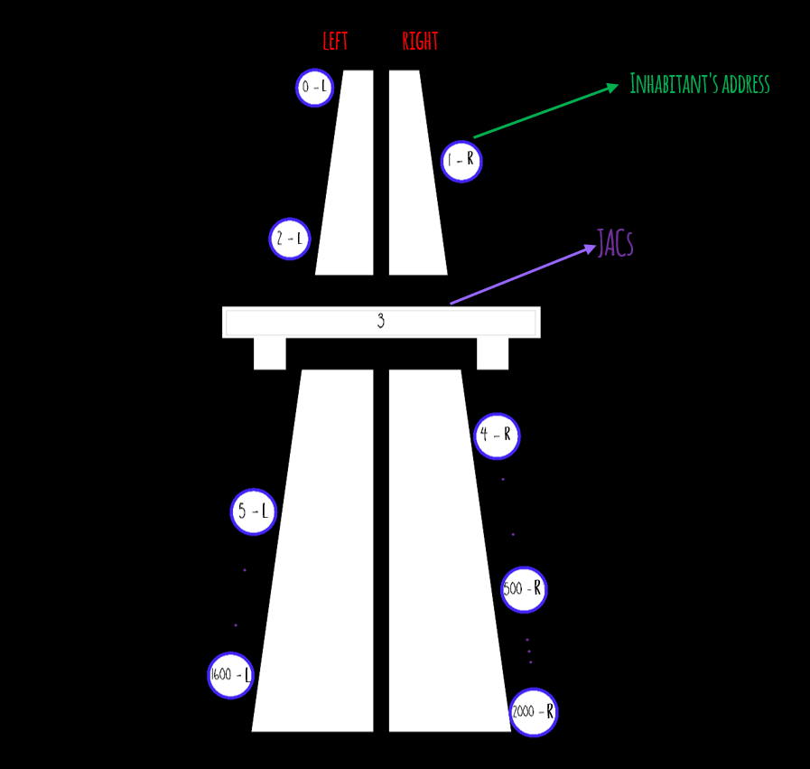

# 3. cycles and lists

- **What's the problem:**

   A program should be implemented that assigns a job to each inhabitant of a city, taking into account their distance and the day and time of their appointment:

   - Each inhabitant's address should be assigned to the left or right side of the street.

   - Ten Job Assignment Centers (JACs) should be assigned along the street.

   - Each JACs should be assigned the addresses closest to it.

   - One job should be assigned to each inhabitant belonging to each JACs.

- **What is known about the problem:**

   - Addresses are numbers between 0 and 2000 with the letter L if it is on the left side of the street and R in case it is on the right side of the street.
   - the addresses of each JACs are a number between 0 and 2000 since each JACs occupies both sides of the street.

   Also known as:

   - Street Graph:

   

   - The format of the address list is known:
      - address_list=["0-L",1-R",2-R",...,1850-L"]

   - The format of the list with the date and time of the appointment corresponding to each address of the inhabitants is known:
      -  list_appointments = [day,hour:minute]:
         - list_appointments = ["1-0:0",1-0:20",1-0:40",1-1:0"...]

   - Days in the city are only 300 minutes long.

   - The assignment starts on day 1 at 0:00 and takes place every 20 minutes.

   - When the 15th appointment of the day is reached, it is moved to the next day.

- **Outputs or results are:**

   - An address must be assigned to each inhabitant.

   - An address must be assigned to each JACs.

   - A job must be assigned to each inhabitant of the city, taking into account their distance and the day and time of the appointment.
