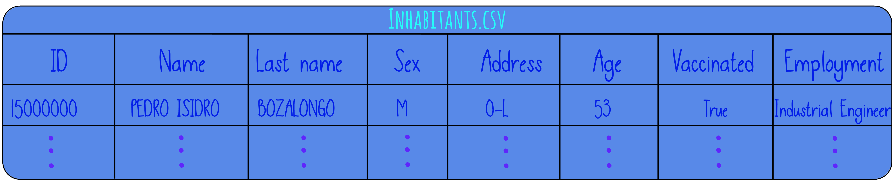

# 5. graphics

- **What's the problem:**

   An application should be implemented that allows those in charge of the city's stability to know statistics that are relevant for decision making.

- **What is known about the problem:**

    - When entering the application you should be able to choose between 9 options:
        1. Chart of number of women and men present in the city.
        2. Graph of the number of people assigned by type of employment.
        3. Graph showing the number of people who have already been vaccinated.
        4. Graph of number of children and number of adults (In the city, being an adult starts at age 25).
        5.	Graph of the number of people living on the right side of the street and on the left side of the street (Remember that the address ends in -R or -L).
        6.	Graph of the number of men and women with the job "Software developer".
        7.	Graph of the number of women assigned to each job.
        8.	Relevant data (average age, oldest and youngest person, number of people between 25 and 45 with the job "Systems Engineer").
        9.	Exit.

   Also known:
    - The order of the information in the database contained in a CSV file:

- **Outputs or results are:**

    - The graph corresponding to the one requested by the user must be displayed.
    - The relevant data of the inhabitants must be shown congruently with the database.
