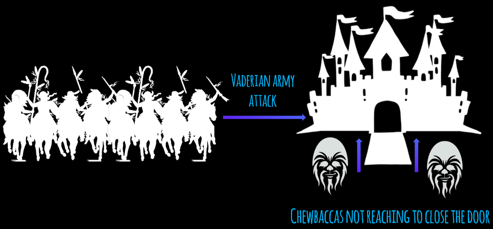
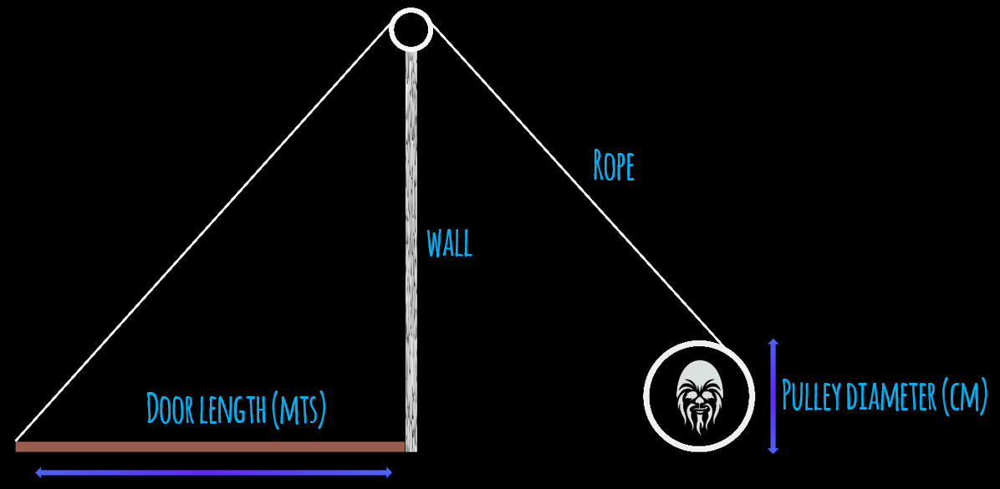

# 1. Variables, arithmetic operators and expressions

- **What's the problem:**

    King Arthur is very worried because the Vaderian army is very close to his castle with the idea of attacking it. And the big door of King Arthur's castle can only be closed under attack, the problem is that it takes a long time to close it because it is pushed from the bottom up by the Chewbaccas soldiers, who, despite their strength, sometimes fail to close it completely.
    

- **What is known about the problem:**

    - The length of the door in meters.
    - The diameter of the pulley in centimeters.
    - Number of times a Chewbacca can turn the pulley.
    - Maximum number of minutes to close the door.

   The drawing of the system to be used is also known:

- **Outputs or results are:**

    - Turns that must be made to close the door completely.
    - The number of Chewbaccas needed to close the door.
    - The speed at which the pulley must rotate (cms/sec) in order to close the door in the given time.

